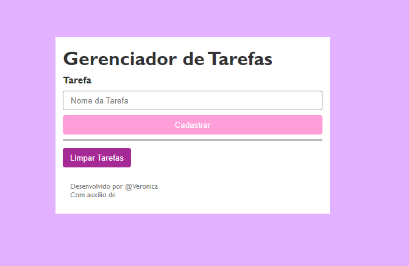

# ToDoList

[ToDoList](#todolist-1) 
[Introdução](#introdu%C3%A7%C3%A3o)
[Executando o Projeto](#executando-o-projeto)
[Como usar](#como-usar)
[Tecnologias ultilizadas](#tecnologias-ultilizadas)
[Fontes consultadas](#fontes-consultadas)
[Autores](#autores)

## ToDoList 
Este é um simples gerenciador de tarefas implementado em PHP. Permite que os usuários cadastrem tarefas e as visualizem em uma lista. O projeto utiliza HTML, CSS e PHP para sua implementação.

## Introdução
O Gerenciador de Tarefas PHP é uma aplicação web que facilita o acompanhamento e organização de tarefas diárias, projetos ou listas de afazeres. Com uma interface intuitiva e fácil de usar, os usuários podem adicionar, visualizar e limpar tarefas de forma rápida e eficiente.

## Executando o Projeto
* Para executar o projeto localmente:

* 1 - Clone este repositório em seu ambiente de desenvolvimento.

* 2 - Certifique-se de ter um ambiente PHP configurado em sua máquina.

* 3 - Abra o arquivo index.php em um navegador web.

## Como usar
* 1 - Cadastro de Tarefas:
Na seção "Tarefa", insira o nome da tarefa que deseja adicionar.
Clique no botão "Cadastrar" para adicionar a tarefa à lista.

* 2 - Visualização de Tarefas:
As tarefas cadastradas serão exibidas em uma lista logo abaixo do formulário de cadastro.

* 3 -Limpeza de Tarefas:
Para limpar todas as tarefas cadastradas, clique no botão "Limpar Tarefas".

## Tecnologias ultilizadas
* ``HTML:`` Linguagem de marcação para estruturar a interface da aplicação web.

* ``CSS:`` Folha de estilo para estilização e layout responsivo da página.

* ``PHP:`` Linguagem de programação server-side para manipulação de dados e lógica de negócios.

* ``Sessões PHP:`` Recurso para armazenar e persistir dados do lado do servidor durante a sessão do usuário.

* ``Github``

* ``VS Code(Visual Code)``

## Fontes consultadas
``https://www.youtube.com/watch?v=dJ49I-QYYUk&ab_channel=MonolitoPHP``

## Autores
``Veronica Borges``